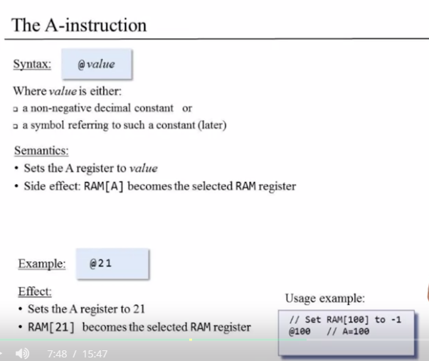

# Hack computer Instrctions

### Registers

- D holds a 16-bit value
- A holds a 16-bit value
- M represents the 16-bit RAM register addressed by A

### Instructors

### A



C


```jsx
//set D register = -1
D=-1
//Set RAM[300] to the value of the D register minus 1
@300 // A=300
M=D-1 // RAM[300]=D-1
//If (D-1==0) jump to execute the instruction stored in ROM[56]
@56 //A=56
D-1;JEQ // if (D-1 == 0) goto 56

```

## Hack Language Specification


AM=D|M;JLT